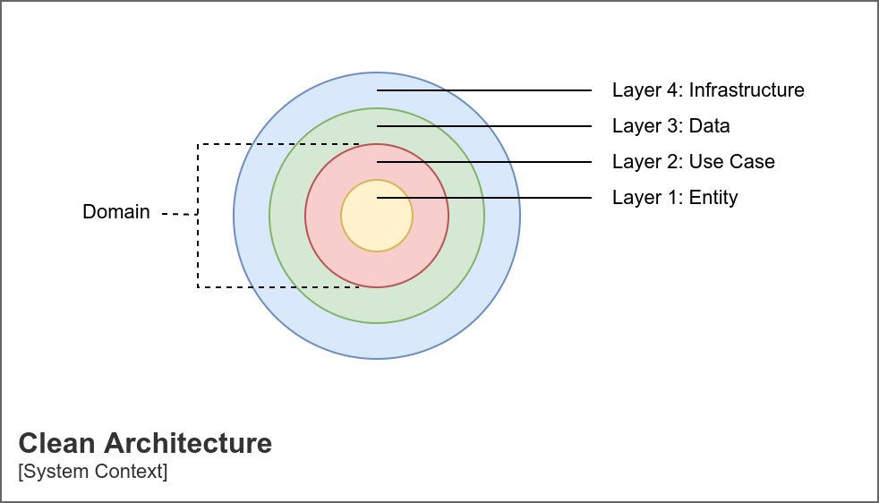
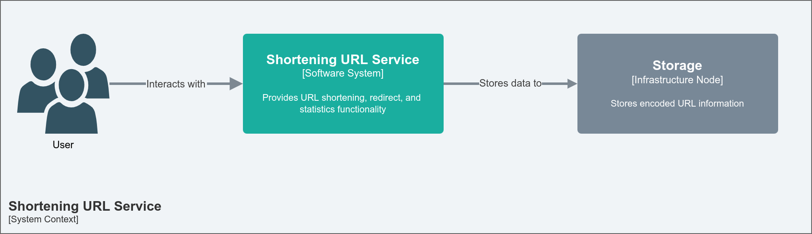
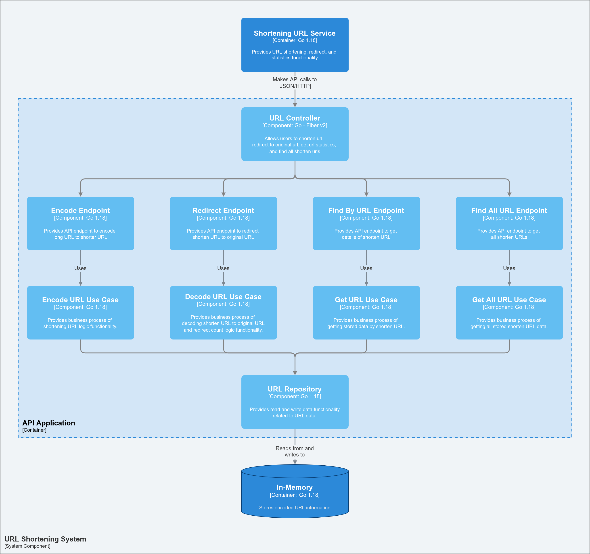
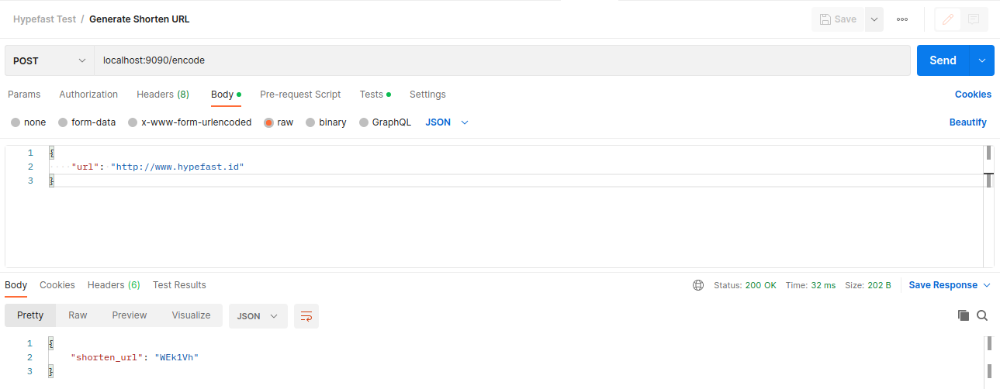
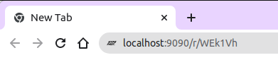
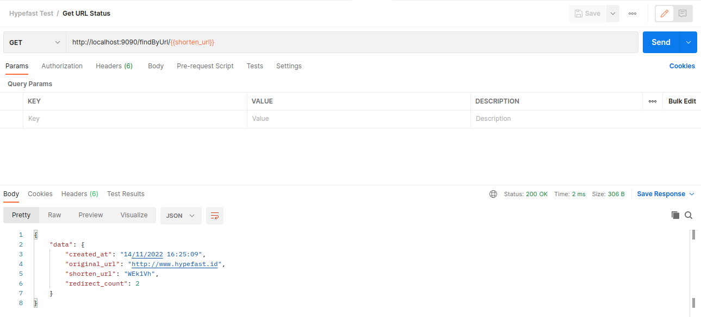
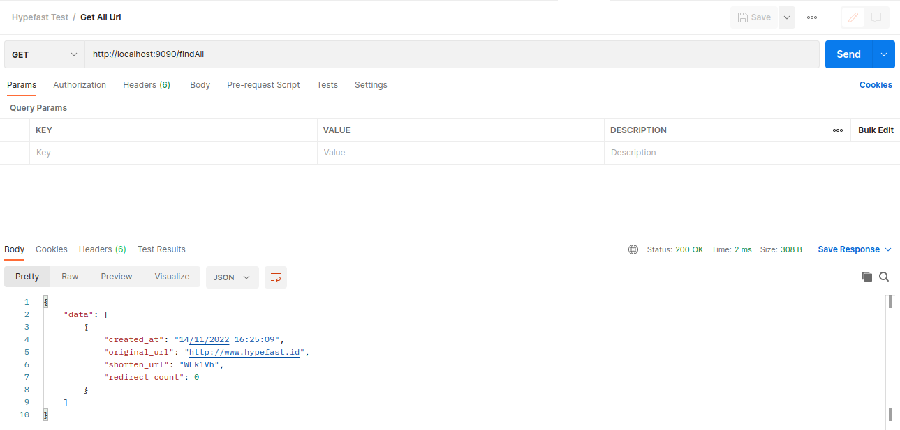

# URL Shortener
This project repository demonstrates an implementation of API-based URL in Go language to create URL shortening web service similar to [Tiny URL](https://tinyurl.com/).


## Contents
1. [Objective](#objective)
2. [System Design](#system-design)
   * [Application Architecture](#application-architecture)
   * [System Architecture](#system-architecture)
     * [Context](#context)
     * [Component](#component)
3. [Documentation](#documentation)
4. [Getting Started](#getting-started)
   * [Prerequisites](#prerequisites)
   * [Build](#build)
   * [Run](#run)
   * [Test](#test)	


## Objective
- [X] Develop a web server application using [Go]((https://golang.org/doc/install) language.
- [X] Generates unique shorten URL of 6 digit alphanumeric characters.
- [X] Redirect shorten URL to original URL.
- [X] Provides detail status of shorten URL.
- [X] Provides API endpoint to access above mentioned features.
- [X] Provides API documentation.
- [X] Unit test for the short URL generation logic.
- [X] Store the data in-memory.

## System Design
### Application Architecture



### System Architecture
The system architecture diagram follows [C4 Model](https://c4model.com/) convention format.

#### Context


#### Component


## Documentation
| No    | API Name     | Method | Endpoint          |
| :---: | ---          | ---    | ---               |
| 1     | Encode       | POST   | /encode           |
| 2     | Redirect     | GET    | /r/{url}          |
| 3     | Find By URL  | GET    | /findByUrl/{url}  |
| 4     | Find All URL | GET    | /findAll          |

### Encode
Generates encoded or shorten URL from given long URL.

Request
```json
{
    "url": "http://www.hypefast.id"
}
```

Response
```json
{
    "shorten_url": "WEk1Vh"
}
```

### Redirect
Decode shorten URL to get original URL then redirect to original URL.

```bash
http://localhost:9090/r/WEk1Vh
```

### Find By URL
Find detail information or status of shorten URL.

Request
```bash
http://localhost:9090/findByUrl/WEk1Vh
```

Response
```json
{
    "data": {
        "created_at": "14/11/2022 16:25:09",
        "original_url": "http://www.hypefast.id",
        "shorten_url": "WEk1Vh",
        "redirect_count": 2
    }
}
```

### Find All
Get all generated shorten URL stored in storage (in-memory, database, cache).

Request
```bash
http://localhost:9090/findAll
```

Response
```json
{
    "data": [
        {
            "created_at": "14/11/2022 16:25:09",
            "original_url": "http://www.hypefast.id",
            "shorten_url": "WEk1Vh",
            "redirect_count": 0
        }
    ]
}
```

## Getting Started
### Prerequisites
1.  Please make sure you have [Go](https://golang.org/doc/install) installed on your system.
2.  Please make sure you have [Postman](https://www.postman.com/downloads/) installed on your system.
3.  Please make sure you have [Docker](https://docs.docker.com/engine/install/) installed on your system (Optional).

### Build
* Executes following command to build and produce linux-based executable binary
```bash
make build-binary
```

* Executes following command to build and produce docker image (Optional)
```bash
make build-docker
```
### Run
1. Executes following command in the root directory of project repository to run the program.
```bash
make run
```

2. Open Postman and import [postman collection](docs/postman_collection.json) to hit the API.

### Test
Run through the API within postman collection to test and validate the application response fulfill requirements and specifications.
#### Encode API


#### Redirect API
Open web browser and run the shorten URL through web service application redirect API endpoint as shown on the following image,



#### Find By URL API



#### Find All URL API
 